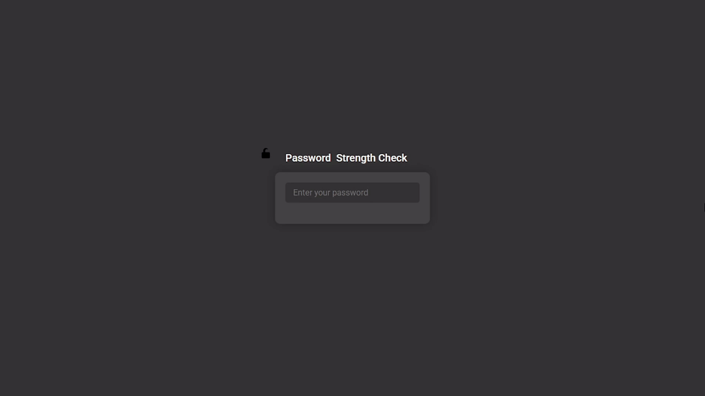

# Password Strength Checker

## 🔐 Overview
This is a **modern, interactive password strength checker** that provides instant feedback on password security. It dynamically updates the strength level (Weak, Medium, Strong) and includes animations, color gradients, and a glowing effect to enhance user experience.

## 🚀 Features
- 🔥 **Live password strength detection**
- 🌈 **Color-coded progress bar and background gradient**
- 💡 **Glowing effect for better UX**
- 🔄 **Smooth animations (fade-in & shake)**
- 🛠️ **Easy to integrate into any project**

## 📸 Demo



## 🛠️ Setup
Follow these steps to run the project locally:

### 1️. Clone the Repository
```sh
 git clone https://github.com/nayandas69/password-strength-checker.git
```

### 2️. Open the Project Folder
```sh
 cd password-strength-checker
```

### 3️. Run Locally
Just open the `index.html` file in your browser:
```sh
 open index.html  # MacOS
 start index.html # Windows
 xdg-open index.html # Linux
```

## 📝 Code Highlights
- **HTML (`index.html`)**: Defines the password input field and UI components.
- **CSS (`index.css`)**: Handles styling, animations, and responsive design.
- **JavaScript (`index.js`)**: Implements password strength logic, animations, and UI updates.

## 📌 How It Works
1. **User types a password** in the input field.
2. **JavaScript detects strength** based on length and updates the UI.
3. **Progress bar & background gradient** change dynamically.
4. **Shake animation** triggers for weak passwords.

## 🔗 Join the Community
### 🎥 Subscribe on YouTube:
Scan the QR code below to subscribe:


or [Click here](https://youtube.com/@dasnayan69)

### 💬 Join our Discord:
Stay connected, ask questions, and share projects!

[Join Discord](https://discord.gg/32zMqPC)

## License
This project is open-source and available under the [MIT License](LICENSE).

**Happy coding!**